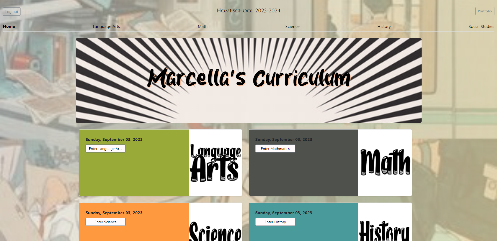
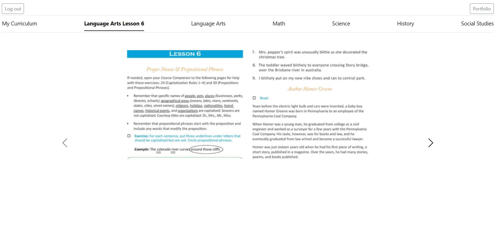

# Sprightly Homeschool & Life

 
 

I am sharing my journey of building a fully functional website application as first a homeshooling mom and as a data analysis. I aimed at improving the organization, productivity, and convenience of homeschooling my soon-to-be eighth-grader. 

### Purpose
  - The Inspiration: The purpose for creating this website was born out of my desire to streamline our homeschooling experience. I wanted a single, customizable platform to manage every aspect of my daughter's education journey, making it more organized and efficient.

  - Centralized Hub: I aimed to bring all aspects of our homeschooling journey under one virtual roof. This includes the ability to customize and showcase specific milestones and achievements from my daughter's school years.

  - Simplifying Complexity: Homeschooling often involves using multiple platforms and teaching methods, which can be overwhelming. I wanted to simplify this complexity by creating an integrated solution.

  - Data Analysis Enthusiast: As a data analysis enthusiast, I saw an opportunity to incorporate database functionality into this project. This would allow me to collect and analyze data related to my daughter's progress and educational journey, as well as, learn and implement some of the practices of database design.

### Development Timeline
I initiated this project on July 28th and successfully completed it on September 1st, just in time for my daughter's first day of school which is on September 4th, 2023.
 
 

# Project structure:

      project_root/
      ├── __pyache__/
      ├── images/
      ├── instance/
      ├── migrations/
      ├── venv/
      ├── website/
      │   ├── __pyache__/
      │   ├── static/
      │   ├── templates/
      │   ├── __init__.py
      │   ├── adminUpload_views.py
      │   ├── authUser_views.py
      │   ├── dashUser_views.py
      │   ├── elaLesson_views.py
      │   ├── historyLesson_views.py
      │   ├── mathLesson_views.py
      │   ├── models.py
      │   ├── scienceLesson_views.py
      │   ├── socialLesson_views.py
      │   ├── webTemps_views.py
      ├── .gitignore
      ├── app.py
      ├── README.md
      ├── requirements.txt
 

# Current Challenges
  - Stalled or Slow Image loads 
   

 

# Challenges Faced
### Potential Problem: studentPortfolio.html Internal 500 Error

I encountered an issue with the studentPortfolio.html page, where I consistently received an Internal 500 OperationalError message when uploading and submitting an image from the computer, which stated, "MySQL Connection not available." Here's a snippet of the error message:

    `OperationalError: (mysql.connector.errors.OperationalError) MySQL Connection not available.
    [SQL: SELECT `userAccount`.`accountTableID` AS `userAccount_accountTableID`, `userAccount`.`userEmail` AS `userAccount_userEmail`, `userAccount`.`userFirstName` AS `userAccount_userFirstName`, `userAccount`.`userLastName` AS `userAccount_userLastName`, `userAccount`.hash AS `userAccount_hash`, `userAccount`.`accountDate` AS `userAccount_accountDate` 
    FROM `userAccount` 
    WHERE `userAccount`.`accountTableID` = %(pk_1)s]
    [parameters: [{'pk_1': 2}]]`

#### Solution:
I am not 100% sure that I resolved this issue , but when I implemented a static image to be automatically used when a student registers, the Internal 500 didn't appear neither on page load or refresh. My actual intent was to have the static image automically fetched and saved to the database upon a new user registration but I couldn't acheive that goal.

### Potential Problem: Internal 500 Error persists
Another issue I faced were random Internal 500 errors displaying everytime a link was selected, a page reloads, or for just signing in. When I viewed my error.log I saw that a `MYSQL Connection Not Available` error message showed up multiple times.

#### Solution:
To tackle this issue, I altered the connection pooling by adding the this line in the app.configuration:

    `app.config['SQLALCHEMY_ENGINE_OPTIONS'] = {'pool_recycle': 280, 'pool_pre_ping':True}`

### Future Improvements
During the development process, I identified several areas where I would like to make enhancements or improvements:

  - Handling 'subAnswer' Column Answers: I aim to find a solution to display multiple values in the 'subAnswer' column as dropdowns and populate them dynamically.

  - Subject Grading: Implementing the correct calculations when there is only one row in the subject tables for accurate subject grading.

  - Customizing studentPortfolio.html: Exploring ways to hide the `<input>` file and upload/submit types, while retaining their functionality to improve the user experience.

  - Refactoring _views.py Files: Finding a more efficient way to assign values to ""PageCurriculum and ""Level for all subjects within the _views.py files.

  - Admin Uploads Page: Exploring methods for bulk image uploads with all the associated form fields on the admin's 'Uploads' page.

  - Subject Curriculum and Level Customization: Identifying a method to allow users to change a subject's curriculum and level as needed.
  
  - Restrict duplicate submissions.

This documentation serves as a testament to my journey in creating the very first website for `Sprightly Homeschool & Life`, and I hope it can be valuable for further development and improvements in the future. Thanks for stopping by!